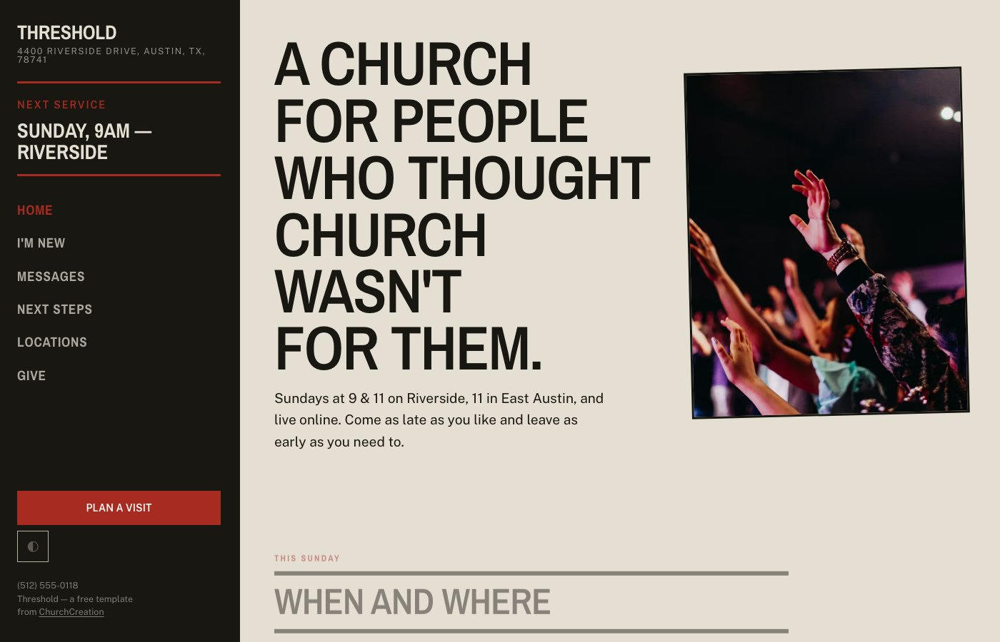
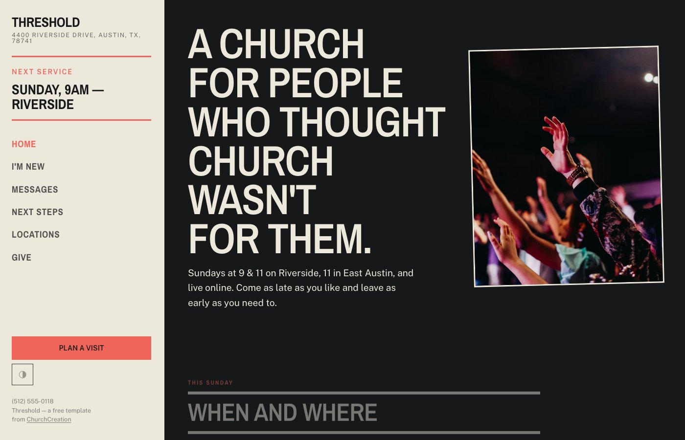
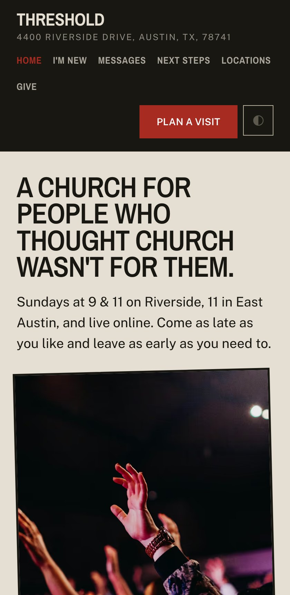

# Threshold — a free church website template for Jekyll

A free website template for church plants, multisite churches and contemporary congregations. A fixed side rail instead of a hero, pages for locations, next steps and messages, and a layout that stays legible when a church meets in three places at two times. Self-hosted typefaces, dark mode, and no external requests.

**[Live demo](https://churchcreation.com/demo/threshold/)** · **[About this template](https://churchcreation.com/templates/threshold/)** · 6 pages · MIT



| Dark mode | On a phone |
|---|---|
|  |  |

## Getting started

Needs Ruby 2.7+ and Bundler.

```bash
bundle install
bundle exec jekyll serve
```

Then build:

```bash
bundle exec jekyll build          # writes _site/
```

## Making it your church's

Almost everything a church needs to change lives in one file — **`church.config.json`**: name, address, phone, service times, giving link, social accounts. Edit that and the header, footer, contact page, map link and structured data all update together, so they cannot drift apart.

The rest:

| Where | What |
|---|---|
| `_layouts/default.html` | the shared layout — header, footer, `<head>` |
| `*.html` | one file per page; the front matter carries its title and description |
| `_data/nav.json` | the navigation, rendered by the layout with `aria-current` on the current page |

## What's included

6 pages: Threshold Church, Give, Locations, Messages, Next steps, I'm new.

Self-contained: the typefaces are bundled and self-hosted, the CSS and JS ship with the template, and there are no external requests, no build step for the assets, and no tracking. Dark mode is included and respects the system setting.

## URLs are flat on purpose

Pages build to `about.html` rather than `/about/`. The template's own runtime depends on it: `core/js/ui.js` marks the current nav link by comparing the last path segment, and `core/js/config.js` fetches `church.config.json` by a relative path. Pretty URLs break both. If you would rather have them, change the two accordingly.

## Licence

MIT — see [LICENSE](LICENSE). Use it for your church, for a client, commercially, whatever. Attribution appreciated, not required. Bundled typefaces are SIL OFL 1.1; see `core/fonts/FONTS.md`.

Photography in the live demo is from Unsplash and is credited in `CREDITS.md`; the download ships neutral placeholders instead.

---

One of ten [free church website templates](https://churchcreation.com/templates/) from ChurchCreation. Built for [Jekyll](https://jekyllrb.com/).
